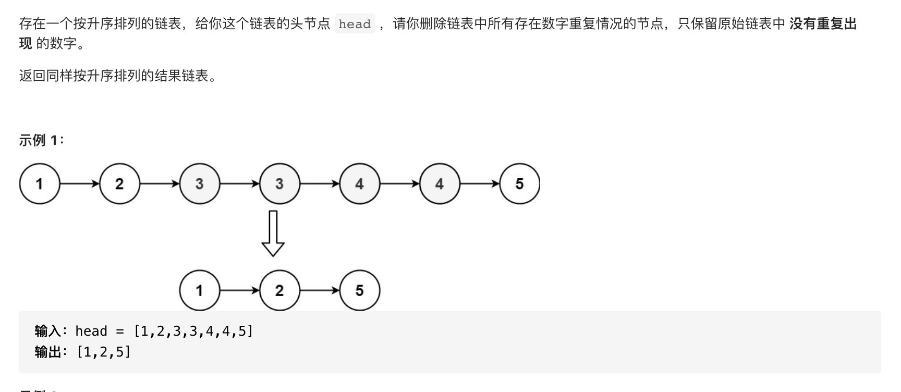

#  **题目描述（中等难度）**

> **[warning] [82. 删除排序链表中的重复元素 II](https://leetcode-cn.com/problems/remove-duplicates-from-sorted-list-ii/)**



#解法一：暴力重组

```java
class Solution {
    public ListNode deleteDuplicates(ListNode head) {
        if(head == null){
            return head;
        }
        ListNode curr = head;
        Map<Integer,Integer> map = new HashMap<>();
        while(curr != null){
          map.put(curr.val,map.getOrDefault(curr.val,0)+1); 
          curr = curr.next;
        }
        ListNode resp = new ListNode(-1);
        ListNode temp = head;
        while(temp != null){
            if(map.get(temp.val) == 1){
                addNode(resp,temp.val);
            }
            temp  = temp.next;
        }
        return resp.next;
    }

    public void addNode(ListNode head,Integer val){
        if(head == null){
            return;
        }
        ListNode curr = head;
        while(curr.next != null){
            curr = curr.next;
        }
        ListNode node = new ListNode(val);
        curr.next = node;
    }
}
```

优化上面代码
```java
/**
 * Definition for singly-linked list.
 * public class ListNode {
 *     int val;
 *     ListNode next;
 *     ListNode() {}
 *     ListNode(int val) { this.val = val; }
 *     ListNode(int val, ListNode next) { this.val = val; this.next = next; }
 * }
 */
class Solution {
    public ListNode deleteDuplicates(ListNode head) {
        if(head == null){
            return head;
        }
        ListNode curr = head;
        Map<Integer,Integer> map = new HashMap<>();
        while(curr != null){
          map.put(curr.val,map.getOrDefault(curr.val,0)+1); 
          curr = curr.next;
        }
        ListNode dummy = new ListNode(-1);
        ListNode resp = dummy;
        ListNode temp = head;
        while(temp != null){
            if(map.get(temp.val) == 1){
                ListNode ans = new ListNode(temp.val);
                dummy.next = ans;
                dummy = dummy.next;
            }
            temp  = temp.next;
        }
        return resp.next;
    }


}
```

#解法二：一次遍历

```java
class Solution {
    public ListNode deleteDuplicates(ListNode head) {
        if(head == null){
            return head;
        }
        ListNode dummy = new ListNode(-1);
        dummy.next = head;
        ListNode curr = dummy;
        while(curr.next != null && curr.next.next != null){
            if(curr.next.val == curr.next.next.val){
                int x = curr.next.val;
                while(curr.next != null && curr.next.val == x){
                    curr.next = curr.next.next;
                }
            }
            else{
                curr = curr.next;
            }
        }
        return dummy.next;
    }
}
```
