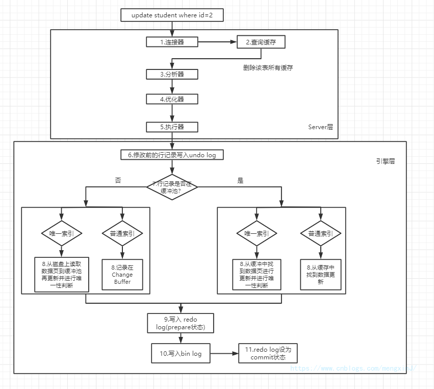
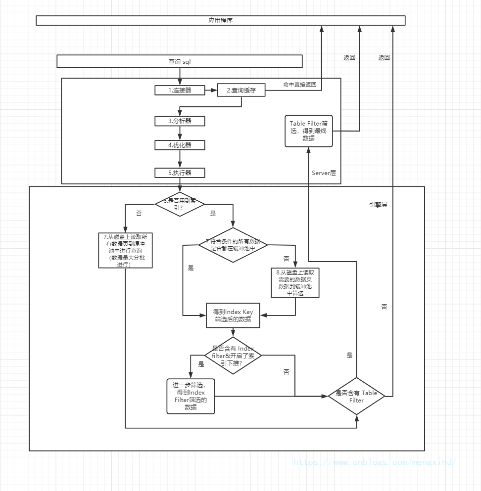
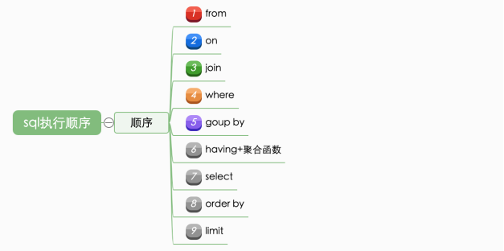

# 面试总结2

##cms的原理，是否发生stop the world，有什么缺点

cms(Concurrent Mark Sweep) 收集器是一种以获取最短停顿时间为目标的收集器，是基于标记清除的算法实现的。

整个垃圾回收过程有四步

- 初始标记：标记一下GC Roots 能直接关联的对象，速度很快  （stop the world）
- 并发标记：并发标记是从GCRoot开始继续向下进行标记
- 重新标记：修正在并发标记过程中发生变化的标记   (stop the world)
- 并发清除：标记清除算法，清除老年代中的垃圾

整个垃圾回收过程中耗时最长的并发标记和并发清除过程收集器线程和用户线程一起工作，并发执行。

CMS收集器的优点：并发收集、低停顿。

CMS收集器的缺点：

- CMS收集器对CPU资源非常敏感：由于收集器线程(最耗时的并发标记和并发清除)和用户线程并发执行，收集器占用一部分线程、cpu导致应用程序变慢。
- CMS处理器无法处理浮动垃圾： 并发清理阶段用户线程还在运行，收集器标记后，用户线程产生了新的垃圾，CMS无法在本次进行处理，只能等待下一次gc处理。
- CMS基于标记清除算法会产生内存碎片：空间碎片过多会给大对象分配带来麻烦，可能会提前触发Full GC.

##老年代垃圾回收放不下了，会发生什么。
此时就会直接触发-次"FullGC" , 就是对老年代进行垃圾回收,尽量腾出来-些内存空间,然后再执行Minor GC.

Full GC就是对老年代进行垃圾回收,同时也一般会对新生代进行垃圾回收

如果要是Full GC过后, 老年代还是没有足够的空间存放Minor GC过后的剩余存活对象,那么此时就会导致所谓的"OOM"内存溢出了

##老年代用标记的主要原因是什么。

标记垃圾，如果使用复制算法，需要两倍的空间，而且需要复制很多存活的对象，老年代对象存活时间久。

##数据库sql的执行过程

一条更新语句的执行过程

一条查询语句的执行过程

sql执行顺序

##索引为什么用b+树，而不是用b树，为什么不用红黑树。

B+树只有叶子节点存储数据，其余节点用来索引，B-树每个节点都有Data域，增到了节点大小，增加了磁盘IO次数。B+树相对于B树磁盘IO次数少。

B+树相对于B树查询性能稳定，所有数据都在叶子节点，B树不稳定，数据在根节点和叶子节点分散，效率会不一样。

B+树支持范围查询，B+树的所有叶子节点用指针串起来了，遍历节点就能获取所有数据，可以进行区间查询。

AVL树和红黑树基本都是存储在内存中才会使用的数据结构，mysql数据是存在磁盘的，红黑树是二叉搜索树，深度太深，磁盘IO次数太多，效率低下

##innodb和myisam中索引的区别。

- 存储结构：InnoDB是聚集索引，数据文件是和（主键）索引绑在一起的，即索引 + 数据 = 整个表数据文件。MyISAM是非聚集索引，也是使用B+Tree作为索引结构，索引和数据文件是分离的，索引保存的是数据文件的指针
- 锁：myisam使用的是表锁、innodb使用的是行锁。
- 事务：myisam不支持事务与MVVC,InnoDB支持事务与MVVC
- 主键：myisam允许没有任何索引和主键的表存在，InnoDB如果没有设定主键或非空唯一索引，会自动生成主键。
- 外键：myisam不支持外键，innodb支持。

##spring aop的原理。cglib和jdk动态代理的原理，有什么区别。为什么jdk动态代理不继承类。

##数据库的隔离级别，可重复读是否解决了幻读的问题，发生幻读举个例子。mysql怎么解决幻读的问题。

- 读未提交：也就是允许读到未提交的内容，这种情况下查询是不会使用锁的，可能会产生脏读、不可重复读、幻读等情况。
- 读已提交：读已提交就是只能读到已经提交的内容，可以避免脏读的产生，属于RDBMS中常见的默认隔离级别（比如说Oracle和SQL Server），但如果想要避免不可重复读或者幻读，就需要我们在SQL查询的时候编写带加锁的SQL语句。
- 可重复读：保证一个事务在相同查询条件下两次查询得到的数据结果是一致的，可以避免不可重复读和脏读，但无法避免幻读。MySQL默认的隔离级别就是可重复读。
- 串行化：将事务进行串行化，也就是在一个队列中按照顺序执行，可串行化是最高级别的隔离等级，可以解决事务读取中所有可能出现的异常情况，但是它牺牲了系统的并发性。

可重复读无法解决幻读问题，串行化可以解决幻读问题。

## mysql有哪些锁。mvcc怎么实现。当前读怎么操作。

##线程池有哪些参数。默认的拒绝策略有哪些。最大线程数有什么用。

ThreadPoolExecutor类可设置的参数主要有：

- int corePoolSize: 线程池的核心线程数
- int maximumPoolSize: 线程池的最大线程数
- long keepAliveTime: 当线程数大于核心数时，多余的空闲线程等待新任务的存活时候
- TimeUtil unit: keepAliveTime: 的时间单位
- ThreadFactory threadFactory: 线程工厂
- BlockingQueue<Runnable> workQueue： 用来存储等待执行任务的队列
- RejectedExecutionHandler handler： 拒绝策略

拒绝策略：

- AbortPolicy(默认) ：丢弃任务并抛出RejectedExecutionException
- CallerRunsPolicy：由调用线程处理该任务。(例如io操作，线程消费速度没有NIO快，可能导致阻塞队列一直增加，此时可以使用这个模式)
- DiscardPolicy：丢弃任务，但是不抛出异常。 （可以配合这种模式进行自定义的处理方式）
- iscardOldestPolicy：丢弃队列最早的未处理任务，然后重新尝试执行任务（重复执行）

##强引用、软引用、弱引用、虚引用有什么区别。

强引用： Object obj = new Object()中的obj就是强引用，只要强引用还存在，垃圾回收器就永远不会回收调此类对象，JVM宁愿抛出OutOfMemoryError.

弱引用：只有当JVM认为内存不足，在内存即将发生内存溢出之前，才会回收，软引用可用来实现内存敏感的高速缓存。

软引用: 软引用关联的对象只能存活到下一次垃圾收集发生之前，无论内存是否足够，都会回收。

虚引用：垃圾回收时收到一个系统通知。

##threadlocal用过么，原理是什么。

Threadlocal底层是通过threadlocalMap进行存储键值 每个ThreadLocal类创建一个Map，然后用线程的ID作为Map的key，实例对象作为Map的value，这样就能达到各个线程的值隔离的效果。 ThreadLocal的作用是提供线程内的局部变量，这种变量在线程的生命周期内起作用，减少同一个线程内多个函数或者组件之间一些公共变量的传递的复杂度。

ThreadLocal 和Synchonized

两者都是解决多线程并发访问，Synchronized用于线程间的数据共享，而ThreadLocal则用于线程间的数据隔离，Synchronized是利用锁的机制，使变量或代码块在某一时该只能被一个线程访问。而ThreadLocal为每一个线程都提供了变量的副本，使得每个线程在某一时间访问到的并不是同一个对象，这样就隔离了多个线程对数据的数据共享。而Synchronized却正好相反，它用于在多个线程间通信时能够获得数据共享

ThreadLocal提供了线程本地变量，ThreadLocal提供了线程本地变量，它可以保证访问到的变量属于当前线程，每个线程都保存有一个变量副本，每个线程的变量都不同。ThreadLocal相当于提供了一种线程隔离，将变量与线程相绑定。

